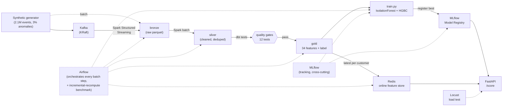

# SignalLake

A local, real-time data + ML platform for transaction anomaly detection: a synthetic event
generator with injected anomalies feeds Kafka, Spark builds a 34-feature gold table behind dbt
quality gates, MLflow tracks and registers the winning model, and a FastAPI + Redis online store
serves it -- all orchestrated by Airflow, all running locally in WSL2. No real data, no cloud
account, no cost: everything below is on synthetic data, and every number is one this pipeline
actually produced (see `SignalLake_BUILD_PLAN.md` §1).



## Metrics (measured)

_Full context and qualifiers for each number: [`reports/METRICS.md`](reports/METRICS.md)._

| Metric | Value | Qualifier |
|---|---|---|
| Events processed | 2,100,000 | synthetic data, 30 days, 2,000 customers |
| Reusable features | 34 | Spark windowed aggregates, 4 trailing windows |
| Anomaly detection F1 | 0.880 (precision 0.915, recall 0.848) | held-out test split of synthetic data, not accuracy |
| Online scoring p95 latency | 240 ms | in load tests, 80 concurrent users, shared local dev machine |
| Recompute reduction | 63.1% fewer work units | vs. full-recompute baseline, incremental watermark rebuild |

## Prerequisites

- **WSL2 Ubuntu** (native Windows isn't supported here -- Airflow needs POSIX, and PySpark on
  native Windows needs `winutils.exe`/`HADOOP_HOME` hacks that WSL2 avoids entirely)
- **Docker Desktop**, with WSL2 integration enabled for your distro
- **Java 17** (Temurin) -- required by PySpark: `sudo apt install -y temurin-17-jdk`
- **Python 3.11+** and [**uv**](https://docs.astral.sh/uv/)
- Keep the repo under the Linux filesystem (e.g. `~/projects/signallake`), not `/mnt/c/...` --
  Spark I/O on the Windows-mounted filesystem is slow.

## Quickstart

```bash
git clone <this repo> && cd signallake
cp .env.example .env
make install        # uv sync
make demo           # up -> generate -> features -> dbt-test -> train -> load-online -> serve -> sample /score calls
```

`make demo` runs the entire pipeline end-to-end on 200k events (a few minutes), in an isolated
`data/demo/` directory so it never touches a larger dataset you build separately, and prints a
summary with the MLflow UI link and a couple of live `/score` responses.

To run the full-scale pipeline (2.1M events, the numbers in the metrics table above) phase by
phase instead:

```bash
make up                       # Kafka (:9092), Redis (:6379), MLflow (:5000), Postgres (:5433, Airflow's metadata DB)
make generate                 # 2.1M synthetic events -> data/bronze
make features                 # Spark: bronze -> silver -> gold (34 features)
make dbt-test                 # dbt quality gates on silver
make train                    # IsolationForest + 3 HGBC runs, best registered in MLflow
make load-online               # latest per-customer features -> Redis
make serve                    # FastAPI online scoring at :8000
make loadtest                 # headless Locust run, writes p50/p95/p99 to reports/METRICS.md
make airflow-init && make airflow   # orchestrate the above as DAGs (own venv, own login printed)
```

MLflow UI: http://localhost:5000 &nbsp;·&nbsp; Airflow UI (while `make airflow` is running): http://localhost:8080

`make help` lists every target with a one-line description.

## Project layout

```
src/signallake/
├── generate/        # synthetic events + anomaly injection (Phase 1)
├── streaming/        # Spark: Kafka -> bronze (Phase 2)
├── features/         # Spark: bronze -> silver -> gold, 34 features (Phase 2)
├── train/             # sklearn + MLflow tracking/registry (Phase 4)
├── serve/             # FastAPI + Redis online store + load test (Phase 5)
├── orchestration/     # recompute benchmark logic, called by the Airflow DAG (Phase 6)
└── common/            # config, schemas, logging, shared MLflow/metrics helpers
dbt/signallake_dbt/     # quality gates on the silver layer (Phase 3)
airflow/dags/           # pipeline DAG + incremental-recompute benchmark DAG (Phase 6)
loadtest/               # locustfile.py (Phase 5)
scripts/                # demo.sh, dbt bad-data demo
reports/METRICS.md      # the real, measured numbers
docs/INTERVIEW.md       # how to talk about this project and defend each metric
```

See `SignalLake_BUILD_PLAN.md` for the full phase-by-phase build plan this was built from.
